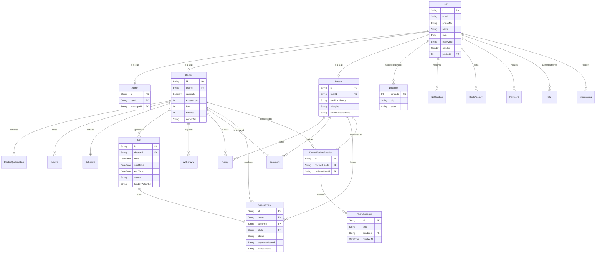

# Quick-Clinic Entity-Relationship (ER) Diagram

This document illustrates the structural database design of the Quick-Clinic platform, reverse engineered from the Prisma schema. It visualizes the core connections between users, authentications, roles, scheduling, and transactions.

