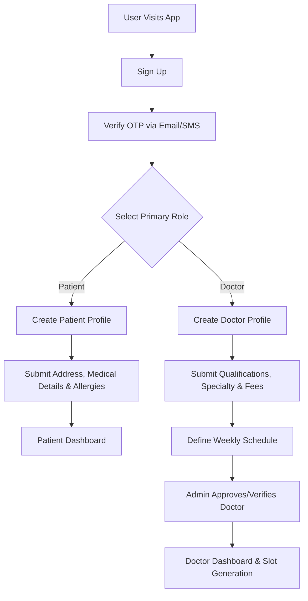
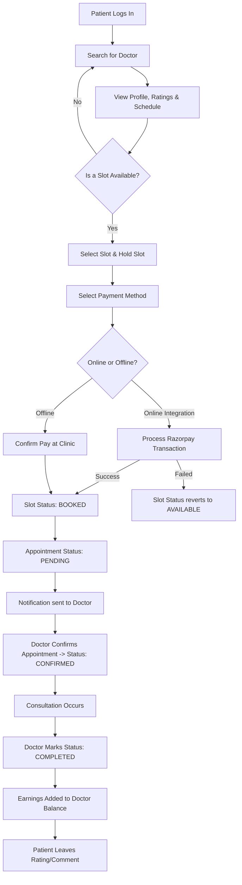
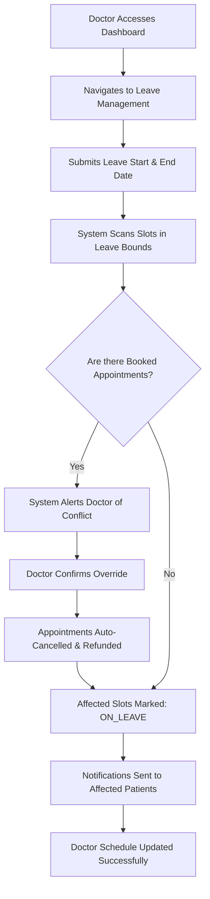
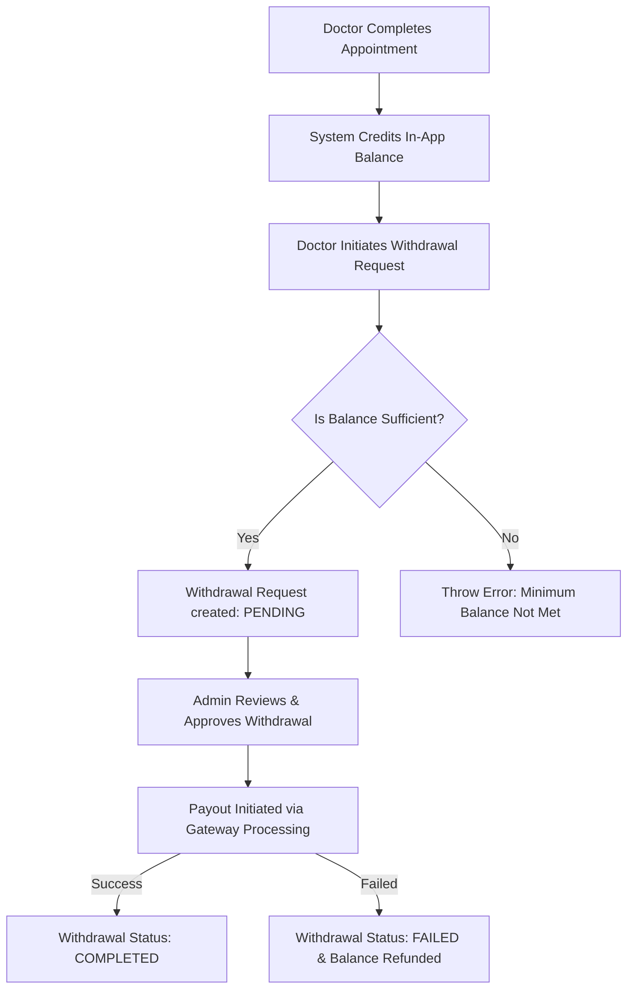

# Quick-Clinic Workflows

This document outlines the core operational workflows and logics for the Quick-Clinic application using Mermaid.js charts. 

## 1. User Registration & Role Assignment Flow

## 2. Appointment Booking Workflow (Patient & Doctor Interaction)

## 3. Doctor Leave & Slot Auto-Management Workflow

## 4. Financial & Earnings Withdrawal Workflow

